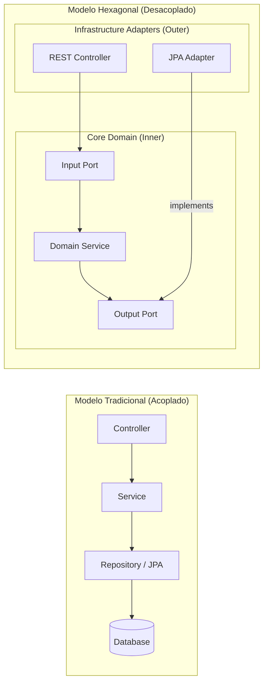

# Manual: Arquitetura Hexagonal (Ports and Adapters)

Este guia explica a **Arquitetura Hexagonal**, um padrão que foca em isolar a lógica de negócio do mundo externo (banco de dados, APIs, telas).

---

## 1. O Problema da Arquitetura Tradicional (Camadas)
No modelo `Controller -> Service -> Repository`:
- Sua regra de negócio (Service) está "presa" ao banco de dados (Repository).
- Se você quiser trocar o MySQL pelo MongoDB, você terá que alterar o Service.
- O código do banco de dados (JPA) vaza para dentro da lógica de negócio.

---

## 2. A Solução Hexagonal
A ideia é colocar a **Lógica de Negócio no Centro** (o Core). Nada externo entra no Core sem passar por um "Portão" (**Port**).

### Os 3 Elementos Principais:
1.  **Domain (Core)**: Contém as Entidades de Negócio e a Lógica (Services). É Java Puro. Não conhece Spring, JPA ou RabbitMQ.
2.  **Ports (Interfaces)**: São as definições de entrada e saída. 
    - *Entrada*: O que eu ofereço (ex: `CriarClientePort`).
    - *Saída*: O que eu preciso de fora (ex: `SalvarClienteNoBancoPort`).
3.  **Adapters (Implementações)**: É onde o mundo externo se conecta.
    - *Adapter de Entrada*: O **Controller** REST que chama o Port.
    - *Adapter de Saída*: O **Repository** JPA que implementa o Port de banco.

---

## 3. Visualização: Camadas vs Hexagonal



---

## 4. Comparação Prática: Entidade Cliente

### Cenário 1: Padrão Tradicional (O que você faz hoje)
Neste modelo, o seu Service está acoplado ao banco de dados e ao Spring.

```java
// Entidade JPA (Acoplada ao Banco)
@Entity
@Table(name = "clients")
public class ClientEntity {
    @Id @GeneratedValue private Long id;
    private String name;
    private String email;
}

// Service (Acoplado ao Repositório do Spring)
@Service
public class ClientService {
    private final ClientRepository repository; // Dependência direta do JPA

    public void create(ClientDTO dto) {
        ClientEntity entity = new ClientEntity(dto.getName(), dto.getEmail());
        repository.save(entity); // Se trocar o banco, esse método quebra
    }
}
```

---

### Cenário 2: Padrão Hexagonal (O Padrão Sênior)
Aqui, dividimos o código em **Core (Domínio)** e **Infrastructure (Adapters)**.

#### A. O Core (Negócio Puro - Não conhece banco nem Spring)
```java
// 1. Objeto de Domínio (Java Puro)
public class Client {
    private String name;
    private String email;
}

// 2. O Port de Saída (Interface)
public interface ClientOutputPort {
    void persist(Client client);
}

// 3. A Lógica (Service de Domínio)
public class ClientUseCase {
    private final ClientOutputPort outputPort; // Depende de INTERFACE, não de banco

    public void execute(Client client) {
        // Lógica de negócio pura...
        outputPort.persist(client);
    }
}
```

#### B. A Infraestrutura: Adapter SQL (PostgreSQL/MySQL)
```java
@Component
public class SqlDatabaseAdapter implements ClientOutputPort {
    private final JpaRepository jpa;

    @Override
    public void persist(Client client) {
        // Converte domínio para entidade JPA e salva
        jpa.save(new ClientEntity(client.getName(), client.getEmail()));
    }
}
```

#### C. O Poder da Troca: Adapter NoSQL (MongoDB)
Imagine que o volume cresceu e você decidiu trocar para o **MongoDB**. No Hexagonal, o Core **não muda**. Você apenas cria um novo Adapter.

```java
@Component
@Primary // Define que este agora é o principal
public class MongoDatabaseAdapter implements ClientOutputPort {
    private final MongoRepository mongo;

    @Override
    public void persist(Client client) {
        // Converte domínio para Documento MongoDB e salva
        mongo.save(new ClientDocument(client.getName(), client.getEmail()));
    }
}
```

---

## 5. Comparativo: Tradicional vs Hexagonal

| Característica | Tradicional (Layered) | Hexagonal |
| :--- | :--- | :--- |
| **Dependência** | Service depende do Repository. | Repository depende do Domínio. |
| **Banco de Dados** | É o coração da aplicação. | É apenas um detalhe externo. |
| **Testes** | Difícil testar Service sem Mock de banco. | Fácil testar o Domínio com Java puro. |
| **Spring** | Está em todo lugar. | Fica apenas nos Adapters externos. |

---

## 6. Dica para a Entrevista
Se te perguntarem a vantagem:
> *"A Arquitetura Hexagonal garante que minha **regra de negócio seja imortal**. Eu posso trocar o banco de dados (de SQL para NoSQL), o framework web ou o sistema de mensageria sem tocar em uma única linha da minha lógica de domínio, pois ela está protegida por Ports e Adapters."*
