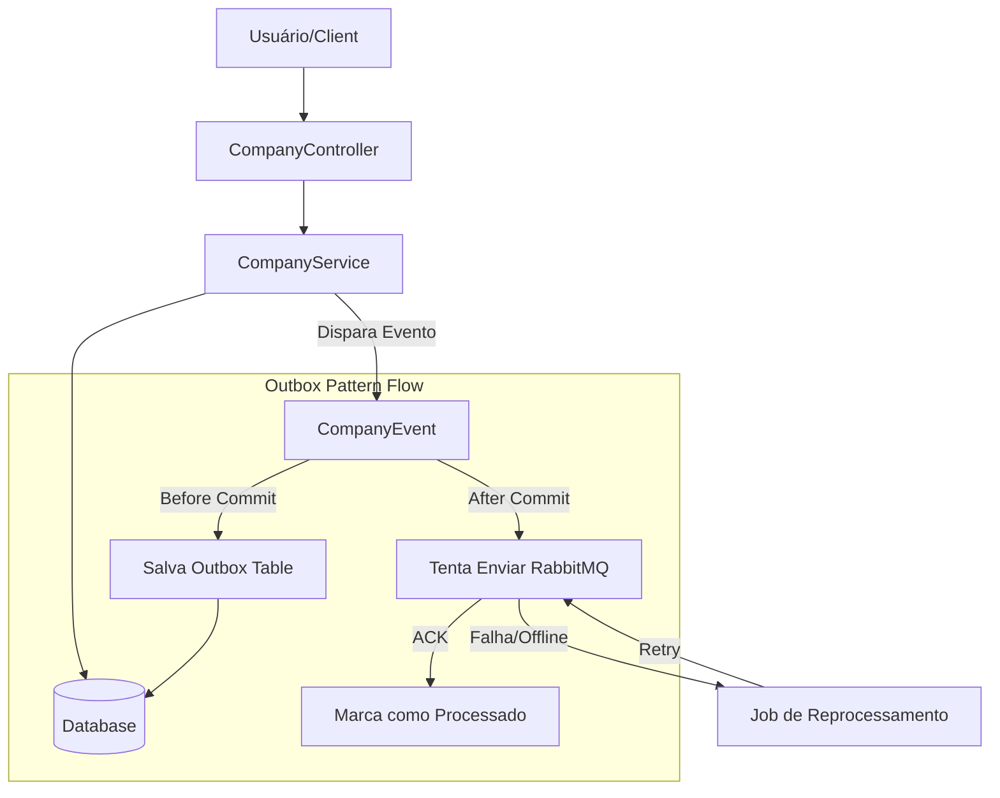
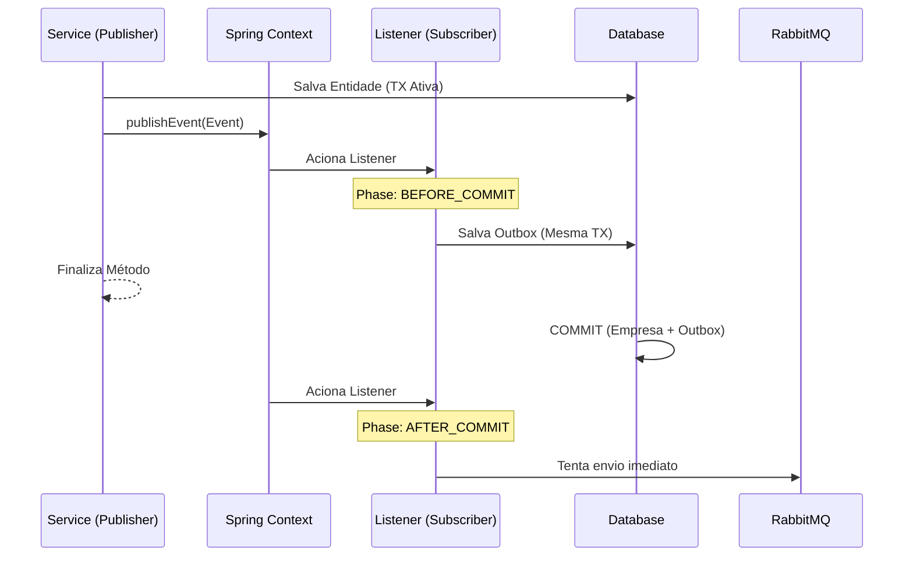

# Manual de Implementação: Resiliência em Mensageria RabbitMQ

Este documento serve como um guia técnico para implementar padrões de resiliência no envio de mensagens, utilizando a entidade `Company` como exemplo prático.

## 1. Fundamentos Teóricos

### A. Publisher Confirms (Opção Rápida)
O RabbitMQ fornece um mecanismo onde o broker confirma ao produtor que a mensagem foi recebida e processada.
- **ACK (Acknowledge)**: O broker confirma o recebimento.
- **NACK (Negative Acknowledge)**: O broker sinaliza falha (ex: falta de disco).
- **Cenário de Queda**: Se o broker estiver offline, o envio lança uma exceção. Em métodos `@Transactional`, isso causa o **Rollback** automático do banco de dados, garantindo que o dado não seja criado sem a mensagem.

### B. Outbox Pattern (Opção Robusta)
Consiste em salvar a mensagem em uma tabela de banco de dados (`outbox_message`) na mesma transação da entidade principal.
- **Garantia**: Entrega "At Least Once". Mesmo que o RabbitMQ caia, a intenção de envio está salva no banco.
- **Fluxo**: 
  1. Salva Entidade + Salva Outbox (Mesma Transação).
  2. Dispara evento assíncrono para envio imediato.
  3. Scheduler em background reprocessa mensagens que ficarem com status `PENDING`.

---

## 2. Implementação com Exemplo: Entidade `Company`

### Passo 1: Modelo de Dados (Outbox)
Criar uma tabela única para centralizar todas as mensagens pendentes do microserviço.

```java
@Entity
@Table(name = "outbox_message")
public class OutboxMessage {
  @Id @GeneratedValue private Long id;
  private String destination; // Fila ou Exchange
  @Lob private String payload; // JSON do DTO
  @Enumerated(EnumType.STRING) private OutboxStatus status; // PENDING, PROCESSED, FAILED
  private LocalDateTime createdAt;
}
```

### Passo 2: Publisher Confirms
Configurar o `RabbitTemplate` para monitorar o retorno do broker.

```java
public void sendWithConfirm(CompanyDTO dto) {
    CorrelationData correlationData = new CorrelationData(UUID.randomUUID().toString());
    
    correlationData.getFuture().addCallback(result -> {
        if (result.isAck()) {
            log.info("Mensagem confirmada para Empresa: {}", dto.getId());
        } else {
            log.error("Falha (NACK) no RabbitMQ para Empresa: {}", dto.getId());
        }
    }, ex -> log.error("Erro de conexão com Broker"));

    rabbitTemplate.convertAndSend("queue.company", dto, correlationData);
}
```

### Passo 3: Outbox Pattern + Application Events
Utilizar os eventos do Spring para desacoplar a criação da empresa do registro do outbox.

1. **Evento**: `CompanyEvent` carrega o DTO e a ação (CREATED/UPDATED).
2. **Disparo**: No `CompanyService`, após salvar a empresa:
   ```java
   eventPublisher.publishEvent(new CompanyEvent(this, companyDTO, actionType));
   ```
3. **Listener (Antes do Commit)**: Garante que o Outbox seja salvo junto com a empresa.
   ```java
   @TransactionalEventListener(phase = TransactionPhase.BEFORE_COMMIT)
   public void handleBeforeCommit(CompanyEvent event) {
       outboxService.saveToOutbox(event.getCompanyDTO(), event.getActionType());
   }
   ```

---

## 3. Como os Eventos Funcionam neste Fluxo

O uso de `ApplicationEvents` e `@TransactionalEventListener` é a "cola" que garante a consistência:

1. **Desacoplamento**: O `CompanyService` não precisa saber como a mensagem é enviada ou salva. Ele apenas "anuncia" que uma empresa foi criada.
2. **Sincronização de Transação**:
   - `BEFORE_COMMIT`: O listener do Outbox executa **dentro** da mesma transação do banco. Se salvar a empresa falhar, o Outbox nem é tentado.
   - `AFTER_COMMIT`: Um segundo listener pode tentar enviar para o RabbitMQ imediatamente. Se o RabbitMQ estiver offline aqui, a empresa **já está salva**, e o Scheduler cuidará do reenvio lendo a tabela de Outbox.

## 4. Diagrama de Arquitetura



## 5. O Papel dos Eventos (Spring Application Events)

O uso de `ApplicationEvents` e `@TransactionalEventListener` é a peça fundamental que garante a consistência entre o banco de dados e a mensageria:

1. **Desacoplamento**: O `CompanyService` não precisa conhecer os detalhes do RabbitMQ ou da tabela de Outbox. Ele apenas dispara um evento informando que uma ação ocorreu.
2. **Sincronização Transacional**:
   - **Phase: BEFORE_COMMIT**: O listener do Outbox executa **dentro** da mesma transação do banco. Isso garante que a mensagem do Outbox só exista se a alteração na Empresa também for salva.
   - **Phase: AFTER_COMMIT**: Permite disparar o envio imediato para o RabbitMQ sem o risco de enviar uma mensagem para uma transação que pode sofrer rollback no banco.



## 6. O Scheduler (Job de Reprocessamento)

O Scheduler é o componente que garante a resiliência final. Ele busca mensagens que não foram enviadas (devido a quedas do RabbitMQ ou da própria App) e retoma o processo.

### Por que ele é fundamental?
- **Recuperação de Desastres**: Se a aplicação cair, ao subir, o Scheduler lê a tabela `outbox_message` e processa o que ficou pendente.
- **Independência do Broker**: A regra de negócio não "trava" se o RabbitMQ estiver offline; o Scheduler tentará o envio em background até obter sucesso.

### Exemplo de Implementação:

```java
@Component
@EnableScheduling
public class OutboxScheduler {

  @Scheduled(fixedDelay = 10000) // Roda a cada 10 segundos
  public void processPendingMessages() {
    // 1. Busca mensagens PENDING no banco
    List<OutboxMessage> pending = repository.findByStatus(PENDING);

    for (OutboxMessage msg : pending) {
      try {
        // 2. Tenta enviar para o RabbitMQ
        rabbitTemplate.convertAndSend(msg.getDestination(), msg.getPayload());
        
        // 3. Sucesso: Marca como PROCESSED
        msg.setStatus(PROCESSED);
        msg.setProcessedAt(LocalDateTime.now());
        repository.save(msg);
      } catch (Exception e) {
        // 4. Falha: Apenas loga. A mensagem continua PENDING para a próxima rodada.
        log.error("Erro ao reprocessar mensagem {}: {}", msg.getId(), e.getMessage());
      }
    }
  }
}
```

## 7. Dead Letter Queue (DLQ)

Enquanto o Outbox trata de falhas no **Produtor** (envio), a DLQ trata de falhas no **Consumidor** (processamento).

### O que é?
É uma fila secundária para onde o RabbitMQ encaminha mensagens que não puderam ser entregues ou processadas com sucesso após várias tentativas.

### Exemplo de Uso:
1. Uma mensagem de "Empresa Criada" chega no Microserviço de Usuários.
2. O banco de dados de usuários está travado.
3. O consumidor tenta processar 3 vezes e falha.
4. Em vez de perder a mensagem ou travar a fila principal, o RabbitMQ move a mensagem para `queue.company.dlq`.

### Benefícios:
- **Isolamento**: Mensagens problemáticas não "entopem" o processamento das mensagens saudáveis.
- **Análise Posterior**: Um desenvolvedor pode inspecionar a DLQ, corrigir o bug e reencaminhar as mensagens para a fila principal.

## 8. Perguntas Frequentes (FAQ)

### Como evitar o processamento em duplicidade (Idempotência)?

Em arquiteturas distribuídas com Outbox, existe o risco de uma mensagem ser enviada ou processada mais de uma vez (entrega "At Least Once"). Para tratar isso, usamos a **Idempotência**.

**Estratégias de Tratamento:**

1. **Identificador Único (Message ID)**:
   - **IMPORTANTE**: Deve ser o **ID da tabela Outbox** (ou um UUID gerado por mensagem), e **não** o ID da Company.
   - *Por que?* Porque uma mesma Company pode ser editada 10 vezes. Se usarmos o Company ID, o consumidor só processaria a primeira vez e ignoraria as 9 atualizações seguintes. Usando o ID da mensagem, garantimos que cada ação individual seja processada.
   - O consumidor (quem recebe) guarda esse ID em uma tabela de "mensagens processadas". Antes de processar qualquer coisa, ele verifica: *"Eu já processei este ID?"*. Se sim, ele apenas ignora.

**Exemplo de Implementação (Consumidor):**

```java
@RabbitListener(queues = "queue.company")
@Transactional
public void consume(CompanyDTO dto, @Header("messageId") String messageId) {
    // 1. Verifica se o ID da mensagem já existe no banco do consumidor
    if (processedMessageRepo.existsById(messageId)) {
        log.warn("Mensagem {} já processada anteriormente. Ignorando.", messageId);
        return;
    }

    // 2. Processa a regra de negócio
    service.saveOrUpdate(dto);

    // 3. Salva o ID da mensagem para evitar reprocessamento
    processedMessageRepo.save(new ProcessedMessage(messageId));
}
```

2. **Operações Idempotentes no Destino**:
   - Desenhar o consumidor para que repetir a mesma ação não cause efeitos colaterais.
   - *Exemplo*: Em vez de "Somar 10 ao saldo", usar "Definir saldo como 100". Se a mensagem chegar 2 vezes, o resultado final será o mesmo.

3. **Unique Constraints no Banco do Consumidor**:
   - O consumidor pode ter uma chave única composta (ex: `empresa_id` + `versao_evento`). Se a mensagem chegar duplicada, o banco de dados do consumidor lançará uma exceção de chave duplicada, impedindo o processamento repetido.

Este manual serve como base para garantir que qualquer nova entidade que necessite de integração via mensageria siga os mesmos padrões de confiabilidade.
