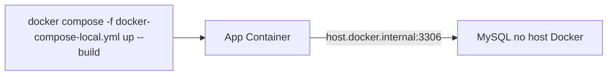
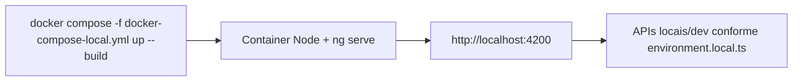

# Docker - Containerização Local

Guia para containerizar aplicações localmente usando Docker, permitindo subir o ambiente de desenvolvimento com um único comando.

> **Contexto:** útil quando você já tem dependências externas (ex: banco de dados) rodando em containers Docker separados e quer rodar a aplicação também em container, sem depender da IDE ou de ferramentas instaladas na máquina.

---

## Pré-requisitos

- [Docker Desktop](https://www.docker.com/products/docker-desktop/) instalado e rodando
- Dependências externas da aplicação já rodando (ex: banco de dados)

---

## Backend (Spring Boot + Kotlin/Java)

### Visão geral



O `host.docker.internal` é um DNS especial que o Docker Desktop resolve para o IP do host. Isso permite que um container acesse serviços rodando no host ou em outros containers avulsos.

---

### Passo 1 — Criar profile Spring exclusivo para Docker

Crie um arquivo `application-docker-local.yml` em `src/main/resources/`.

A diferença principal em relação ao profile local normal é a URL do banco: substitua `0.0.0.0` ou `localhost` por `host.docker.internal`.

```yaml
spring:
  datasource:
    jdbc-url: jdbc:mysql://host.docker.internal:3306/nome_do_banco?rewriteBatchedStatements=true&serverTimezone=America/Sao_Paulo&enabledTLSProtocols=TLSv1.2
    username: root
    password: root
    driver-class-name: com.mysql.cj.jdbc.Driver
    hikari:
      maximum-pool-size: 1
  jpa:
    show-sql: true
    hibernate:
      ddl-auto: update

server:
  port: 8080

# demais configurações do projeto...
```

> **Por que um profile separado?**
> O `localhost` dentro de um container aponta para o próprio container, não para o host. Manter um profile separado evita quebrar o ambiente de quem roda a aplicação fora do Docker (via IDE ou Maven).

---

### Passo 2 — Criar Dockerfile multi-stage

Crie o arquivo `Dockerfile-local` na raiz do projeto.

O **build multi-stage** elimina a necessidade de ter Maven/Java instalados na máquina: tudo acontece dentro do container.

```dockerfile
# Stage 1 - Build
FROM maven:3.9-amazoncorretto-17 AS build
WORKDIR /app
COPY pom.xml .
RUN mvn dependency:go-offline -B
COPY src ./src
RUN mvn clean package -DskipTests -B

# Stage 2 - Runtime
FROM amazoncorretto:17-al2023
VOLUME /tmp
COPY --from=build /app/target/nome-do-projeto.jar /app.jar
EXPOSE 8080

ENTRYPOINT ["java", "-Dspring.profiles.active=docker-local", "-Djava.security.egd=file:/dev/./urandom", "-Duser.timezone=America/Sao_Paulo", "-jar", "/app.jar"]
```

**Pontos de atenção:**
- Ajuste o `amazoncorretto:17-al2023` conforme a versão do Java do projeto
- Substitua `nome-do-projeto.jar` pelo `finalName` definido no `pom.xml`
- O `-Dspring.profiles.active=docker-local` ativa o profile criado no Passo 1

---

### Passo 3 — Criar docker-compose-local.yml

Crie o `docker-compose-local.yml` na raiz do projeto.

> **Por que não `docker-compose.yml`?**
> Se o projeto usa CI/CD com Docker-in-Docker (dind), um `docker-compose.yml` na raiz pode ser detectado automaticamente pela pipeline e causar conflitos. O sufixo `-local` deixa explícito que é para uso local e evita interferência com o CI.

O `name` define como o projeto aparece **agrupado no Docker Desktop**. Use o nome do cliente/produto para facilitar a identificação.

```yaml
name: nome-do-grupo

services:
  nome-do-servico:
    build:
      context: .
      dockerfile: Dockerfile-local
    container_name: nome-do-grupo-nome-do-servico
    ports:
      - "8080:8080"
    extra_hosts:
      - "host.docker.internal:host-gateway"
    restart: unless-stopped
```

**Propriedades importantes:**
| Propriedade | Descrição |
|-------------|-----------|
| `name` | Nome do projeto no Docker Desktop (agrupa containers) |
| `container_name` | Nome visível do container no Docker Desktop |
| `extra_hosts` | Necessário no Linux; no Docker Desktop (Windows/Mac) já é resolvido automaticamente, mas não prejudica incluir |
| `restart: unless-stopped` | Reinicia o container automaticamente se cair, exceto quando parado manualmente |

---

### Passo 4 — Rodar

Como o arquivo não se chama `docker-compose.yml`, é necessário indicar com `-f`:

```bash
# Subir e buildar
docker compose -f docker-compose-local.yml up --build

# Subir sem rebuild (se o código não mudou)
docker compose -f docker-compose-local.yml up

# Parar e remover containers
docker compose -f docker-compose-local.yml down

# Ver logs em tempo real
docker compose -f docker-compose-local.yml logs -f nome-do-servico

# Rebuild forçado (limpa cache do Docker)
docker compose -f docker-compose-local.yml build --no-cache && docker compose -f docker-compose-local.yml up
```

---

### Passo 5 — Atualizar o container após alterações no código

Quando o código-fonte do repositório for atualizado (ex: pull de novas alterações, troca de branch, edições locais), o container precisa ser reconstruído para refletir as mudanças.

```bash
docker compose -f docker-compose-local.yml up --build
```

O `--build` força o Docker a reavaliar as camadas da imagem. O Docker usa **cache inteligente por camadas**:

1. **`COPY pom.xml`** — Se o `pom.xml` não mudou, o download das dependências Maven é reutilizado do cache
2. **`COPY src ./src`** — Se algum arquivo em `src/` mudou, a recompilação é executada a partir desse ponto
3. **Camadas anteriores** (imagem base, dependências) são mantidas em cache

Isso significa que após a primeira execução (que é mais lenta), as reconstruções subsequentes são **significativamente mais rápidas**, pois apenas o código alterado é recompilado.

| Cenário | Comando | Tempo estimado |
|---------|---------|----------------|
| Código-fonte mudou (`src/`) | `docker compose -f docker-compose-local.yml up --build` | ~30s (recompila JAR) |
| Dependências mudaram (`pom.xml`) | `docker compose -f docker-compose-local.yml up --build` | ~2-3min (baixa deps + recompila) |
| Nada mudou, apenas quer subir | `docker compose -f docker-compose-local.yml up` | Instantâneo |
| Suspeita de problema com cache | `docker compose -f docker-compose-local.yml build --no-cache` | ~5min (rebuild total) |

> **Dica:** Na maioria dos casos, `up --build` é suficiente. Use `build --no-cache` apenas quando suspeitar que o cache está corrompido ou desatualizado.

---

### Resultado no Docker Desktop

```
📦 nome-do-grupo (grupo)
  └── 🟢 nome-do-grupo-nome-do-servico (porta 8080)
```

---

### Checklist Backend

- [ ] `application-docker-local.yml` criado com `host.docker.internal` na URL do banco
- [ ] `Dockerfile-local` criado com build multi-stage
- [ ] `docker-compose-local.yml` criado com `name` do grupo e `extra_hosts`
- [ ] `application-docker-local.yml` adicionado ao `.gitignore` se contiver dados sensíveis (senhas locais, etc.)

---

### Quando incluir outros containers no docker-compose (ex: MySQL)

O guia acima assume que você **já tem o banco rodando** em outro container Docker (avulso ou via outro compose). Nesses casos, o `host.docker.internal` é suficiente.

**Porém**, se o banco de dados ainda **não está rodando** no seu Docker local — ou se você quer que o compose suba tudo junto, de forma isolada — adicione o banco como um serviço no mesmo `docker-compose-local.yml`.

```yaml
name: nome-do-grupo

services:
  db:
    image: mysql:8.0
    container_name: nome-do-grupo-db
    environment:
      MYSQL_ROOT_PASSWORD: root
      MYSQL_DATABASE: nome_do_banco
    ports:
      - "3306:3306"
    volumes:
      - db_data:/var/lib/mysql
    healthcheck:
      test: ["CMD", "mysqladmin", "ping", "-h", "localhost"]
      interval: 10s
      timeout: 5s
      retries: 5
    restart: unless-stopped

  nome-do-servico:
    build:
      context: .
      dockerfile: Dockerfile-local
    container_name: nome-do-grupo-nome-do-servico
    ports:
      - "8080:8080"
    depends_on:
      db:
        condition: service_healthy
    restart: unless-stopped

volumes:
  db_data:
```

Quando o banco está **dentro do compose**, a URL do `application-docker-local.yml` deve referenciar o **nome do serviço** (`db`) em vez de `host.docker.internal`:

```yaml
spring:
  datasource:
    jdbc-url: jdbc:mysql://db:3306/nome_do_banco?rewriteBatchedStatements=true&serverTimezone=America/Sao_Paulo
```

**Resumindo:**

| Cenário | URL do banco no `application-docker-local.yml` |
|---------|------------------------------------------------|
| Banco já roda avulso no Docker (fora do compose) | `host.docker.internal:3306` |
| Banco declarado no mesmo `docker-compose-local.yml` | Nome do serviço (ex: `db:3306`) |

---

## Exemplos Práticos

### cache-service (Bowe)

Projeto: `bowe/cache-service` — Spring Boot 3.2.5 + Kotlin 1.9.22, banco MySQL 8.

**Contexto:** O MySQL já rodava avulso no Docker Desktop (container `mysql` na porta 3306). O objetivo era rodar apenas a aplicação em container, aproveitando o banco existente.

#### `src/main/resources/application-docker-local.yml`

```yaml
spring:
  datasource:
    jdbc-url: jdbc:mysql://host.docker.internal:3306/gd?rewriteBatchedStatements=true&serverTimezone=America/Sao_Paulo&enabledTLSProtocols=TLSv1.2
    username: root
    password: root
    driver-class-name: com.mysql.cj.jdbc.Driver
    hikari:
      maximum-pool-size: 1
  jpa:
    show-sql: true
    hibernate:
      ddl-auto: update
    properties:
      hibernate:
        dialect: org.hibernate.dialect.MySQL8Dialect
        jdbc:
          batch_size: 10
        order_inserts: true
        order_updates: true
        rewriteBatchedStatements: true

security:
  jwt:
    secret: <jwt-secret>

server:
  port: 8087

caching:
  concessionarias:
    TTL: "300000"
```

#### `Dockerfile-local`

```dockerfile
# Stage 1 - Build
FROM maven:3.9-amazoncorretto-17 AS build
WORKDIR /app
COPY pom.xml .
RUN mvn dependency:go-offline -B
COPY src ./src
RUN mvn clean package -DskipTests -B

# Stage 2 - Runtime
FROM amazoncorretto:17-al2023
VOLUME /tmp
COPY --from=build /app/target/cache-service.jar /app.jar
EXPOSE 8087

ENTRYPOINT ["java", "-Dspring.profiles.active=docker-local", "-Djava.security.egd=file:/dev/./urandom", "-Duser.timezone=America/Sao_Paulo", "-jar", "/app.jar"]
```

> O `finalName` no `pom.xml` deste projeto é `cache-service`, por isso o JAR é `cache-service.jar`.

#### `docker-compose-local.yml`

```yaml
name: bowe

services:
  cache-service:
    build:
      context: .
      dockerfile: Dockerfile-local
    container_name: bowe-cache-service
    ports:
      - "8087:8087"
    extra_hosts:
      - "host.docker.internal:host-gateway"
    restart: unless-stopped
```

#### Comandos utilizados

```bash
# Subir
docker compose -f docker-compose-local.yml up --build

# Parar
docker compose -f docker-compose-local.yml down
```

#### Resultado no Docker Desktop

```
📦 bowe (grupo)
  └── 🟢 bowe-cache-service (porta 8087:8087)
```

URL de acesso: `http://localhost:8087/api/cache/`

---

## Frontend (Angular / React)

### Visão geral (modo desenvolvimento com hot reload)

Para reproduzir o comportamento do `npm start` no Docker, rode o `ng serve` dentro do container (não usar Nginx nesse cenário).



### Passo 1 — Criar Dockerfile para desenvolvimento local

Crie `Dockerfile-dev-local` na raiz do projeto frontend:

```dockerfile
FROM node:14-alpine

WORKDIR /app

COPY package*.json ./
RUN npm ci

COPY . .

EXPOSE 4200

CMD ["npm", "run", "start", "--", "--host", "0.0.0.0", "--port", "4200", "--poll", "2000"]
```

Esse comando mantém o comportamento do `ng serve -c local`, mas acessível fora do container.

### Passo 2 — Criar docker-compose-local.yml

```yaml
name: bowe

services:
  faturamento-web:
    build:
      context: .
      dockerfile: Dockerfile-dev-local
    container_name: bowe-faturamento-web-local
    ports:
      - "4200:4200"
    volumes:
      - ./:/app
      - /app/node_modules
    environment:
      - CHOKIDAR_USEPOLLING=true
      - WATCHPACK_POLLING=true
      - NODE_ENV=development
    restart: unless-stopped
```

### Passo 3 — Rodar e atualizar

```bash
# Subir com build
docker compose -f docker-compose-local.yml up --build

# Parar
docker compose -f docker-compose-local.yml down

# Ver logs
docker compose -f docker-compose-local.yml logs -f faturamento-web
```

### Atualizar container após alterações no código

Depois de atualizar o código do repositório, execute novamente:

```bash
docker compose -f docker-compose-local.yml up --build
```

No frontend com bind mount (`./:/app`), alterações locais normalmente já refletem via hot reload. O `--build` é necessário quando há mudanças de dependências ou no próprio Dockerfile.

### Exemplo prático — faturamento-web

Aplicado no projeto `bowe/faturamento-web` com:
- `Dockerfile-dev-local`
- `docker-compose-local.yml`
- Porta local `4200`
- Hot reload habilitado por polling para funcionar de forma estável no Docker Desktop

#### Arquivos reais usados no projeto

**`Dockerfile-dev-local`**

```dockerfile
FROM node:14-alpine

WORKDIR /app

COPY package*.json ./
RUN npm ci

COPY . .

EXPOSE 4200

CMD ["npm", "run", "start", "--", "--host", "0.0.0.0", "--port", "4200", "--poll", "2000"]
```

**`docker-compose-local.yml`**

```yaml
name: bowe

services:
  faturamento-web:
    build:
      context: .
      dockerfile: Dockerfile-dev-local
    container_name: bowe-faturamento-web-local
    ports:
      - "4200:4200"
    volumes:
      - ./:/app
      - /app/node_modules
    environment:
      - CHOKIDAR_USEPOLLING=true
      - WATCHPACK_POLLING=true
      - NODE_ENV=development
    restart: unless-stopped
```

#### Configuração de ambiente usada no frontend

O fluxo usa a configuração local já existente do projeto (`ng serve -c local`), com `fileReplacement` para `environment.local.ts` no `angular.json`.

Exemplo de endpoints no `environment.local.ts`:

```ts
export const environment = {
  production: false,
  api: 'http://localhost:8082',
  gd: 'http://localhost:8080',
  robots: 'http://localhost:8089',
  iam: 'https://dev-iam.bow-e.com'
};
```

#### Comandos usados no dia a dia

```bash
# Subir
docker compose -f docker-compose-local.yml up --build

# Parar
docker compose -f docker-compose-local.yml down

# Logs
docker compose -f docker-compose-local.yml logs -f faturamento-web
```

---

## Referências

- [Docker Desktop](https://docs.docker.com/desktop/)
- [Docker Compose - Documentação oficial](https://docs.docker.com/compose/)
- [host.docker.internal](https://docs.docker.com/desktop/networking/#i-want-to-connect-from-a-container-to-a-service-on-the-host)
- [Multi-stage builds](https://docs.docker.com/build/building/multi-stage/)
