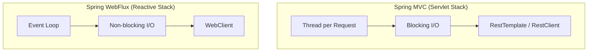

# Estudo de RestClient em Kotlin

Este documento serve como guia de referência para a utilização de clientes HTTP no ecossistema Spring 6+, focando no novo `RestClient` e comparando-o com alternativas legadas e reativas.

## 1. O que é o RestClient?

Introduzido no Spring Framework 6.1, o `RestClient` é um cliente HTTP **síncrono** que oferece uma API moderna e fluente (estilo *builder*), similar à do `WebClient`, mas sem a necessidade da infraestrutura reativa do WebFlux.

### Como utilizar

Para começar a usar, você pode criar uma instância padrão ou customizada:

```kotlin
// Instância padrão
val restClient = RestClient.create()

// Instância customizada com Base URL e Headers
val customClient = RestClient.builder()
    .baseUrl("https://api.exemplo.com")
    .defaultHeader("Authorization", "Bearer token")
    .build()
```

## 2. RestClient vs RestTemplate

| Característica | RestTemplate | RestClient |
| :--- | :--- | :--- |
| **Estilo de API** | Baseada em templates (muitos métodos sobrecarregados) | API Fluente (mais legível e encadeável) |
| **Manutenibilidade** | Considerado legado (manutenção apenas) | Recomendado para novas aplicações síncronas |
| **Tratamento de Erros** | Requer `ResponseErrorHandler` global ou try/catch | Tratamento direto no fluxo com `.onStatus()` |
| **Conversão de Dados** | Automática via `MessageConverters` | Mesma infraestrutura, mas com sintaxe mais limpa |

### Exemplo de diferença na sintaxe:

**RestTemplate (Legado):**
```kotlin
val response = restTemplate.getForObject("https://api.com/users/{id}", User::class.java, 1)
```

**RestClient (Moderno):**
```kotlin
val user = restClient.get()
    .uri("/users/{id}", 1)
    .retrieve()
    .body<User>()
```

## 3. O que é WebFlux?

O **Spring WebFlux** é o framework web reativo do Spring. Ele é construído sobre o **Project Reactor** e utiliza o paradigma de programação reativa para lidar com fluxos de dados de forma não-bloqueante.

### Diferenças Arquiteturais



- **Síncrono (MVC):** Uma thread é ocupada por toda a duração da requisição HTTP.
- **Assíncrono/Reativo (WebFlux):** Utiliza poucas threads para gerenciar muitas requisições simultâneas, liberando a thread enquanto aguarda a resposta do I/O.

## 4. Exemplos de Utilização

### Exemplo Síncrono (com RestClient)

Ideal para aplicações Spring MVC tradicionais onde a simplicidade é prioridade.

```kotlin
fun findUserSync(id: String): User? {
    return restClient.get()
        .uri("/users/{id}", id)
        .retrieve()
        .onStatus(HttpStatusCode::is4xxClientError) { _, response ->
            throw RuntimeException("Usuário não encontrado: ${response.statusCode}")
        }
        .body<User>()
}
```

### Exemplo Assíncrono (com WebClient + Coroutines)

Para aplicações que precisam de alta escalabilidade e performance não-bloqueante. O Kotlin facilita o uso do WebClient através de extensões de corrotinas.

```kotlin
suspend fun findUserAsync(id: String): User? {
    val webClient = WebClient.create("https://api.exemplo.com")
    
    return webClient.get()
        .uri("/users/{id}", id)
        .retrieve()
        .awaitBody<User>() // Extensão do Kotlin para não bloquear a thread
}
```

*Nota: Embora o `RestClient` seja síncrono, ele pode ser executado dentro de uma corrotina `withContext(Dispatchers.IO)`, mas para chamadas verdadeiramente não-bloqueantes de rede, o `WebClient` é a escolha correta.*

## 5. Quando escolher qual?

1. **Use RestClient:** Se o seu projeto é um Spring Boot "standard" (Spring MVC), você não precisa de reatividade complexa e quer um código limpo e moderno.
2. **Use WebClient:** Se o seu projeto é reativo (WebFlux), ou se você precisa fazer muitas chamadas paralelas de API e quer otimizar o uso de recursos.
3. **Evite RestTemplate:** Em novos projetos, pois ele entrará em modo de depreciação futura.

---
*Este documento serve como base para padronização de implementações de clientes HTTP no projeto.*
